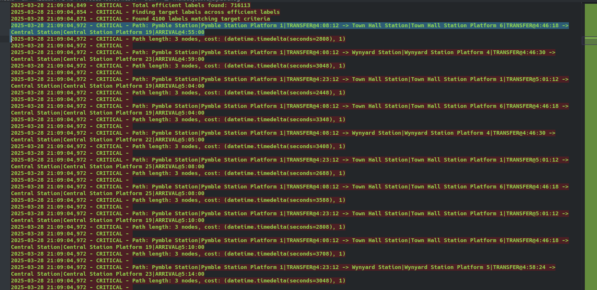

# TransferPatternGeneration
Using python to generate transfer patterns for a gtfs network

### References 
https://github.com/eamsen/transit-planner
https://ad.informatik.uni-freiburg.de/files/transferpatterns.pdf
https://github.com/opentripplanner/OpenTripPlanner/
https://github.com/maristanyPedro/multiobjectiveDijkstra
https://ad-publications.cs.uni-freiburg.de/theses/Master_Jonas_Sternisko_2013.pdf